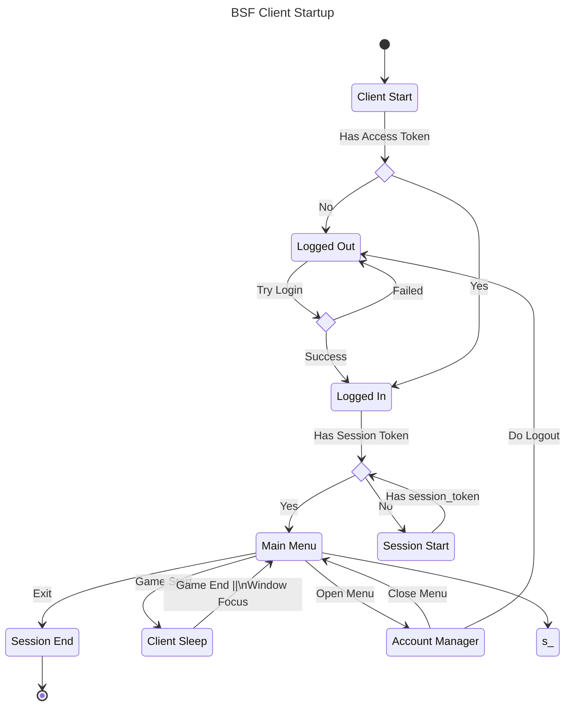

## 📂 Directory structure

Familiar React application structure, just with `electron` folder on the top :wink:  
*Files in this folder will be separated from your React application and built into `dist-electron`*  

```tree
├── electron                                 Electron-related code
│   ├── main                                 Main-process source code
│   └── preload                              Preload-scripts source code
│
├── release                                  Generated after production build, contains executables
│   └── {version}
│       ├── {os}-{os_arch}                   Contains unpacked application executable
│       └── {app_name}_{version}.{ext}       Installer for the application
│
├── public                                   Static assets
└── src                                      Renderer source code
```




