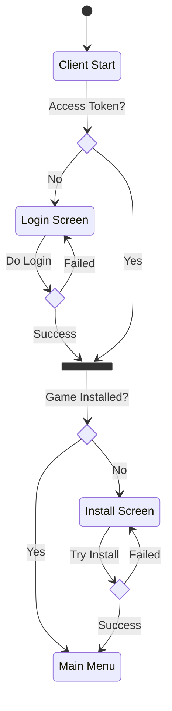

# 🔰 Factions Community Edition Client

Electron based react app, for managing and interfacing with Banner Saga Factions game client using custom game server implementation.

*Project based on [Electron Vite React](https://github.com/electron-vite/electron-vite-react) template.*

## 📂 Directory structure

```tree
├── electron                                 Backend code
│   ├── main/                                Main-process
│   │  ├── ipcModules/                              IPC modules
│   │  └── index.ts                          Main-process
│   ├── preload                              Preload-scripts source code
│   └── *.d.ts                               Typescript definitions
├── public/                                  Static assets
├── src/                                     Frontend source code
│   ├── App.tsx                              Base frontend component
│   ├── components/                          React components
│   ├── views/                               Views    
│   ├── types/                               Types
│   └── store/                               State management (Zustand)
│   
└── release                                  Generated after production build, contains executables
    └── {version}
        ├── {os}-{os_arch}                   Contains unpacked application executable
        └── {app_name}_{version}.{ext}       Installer for the application
```

## 🔄️ Start Up Process

